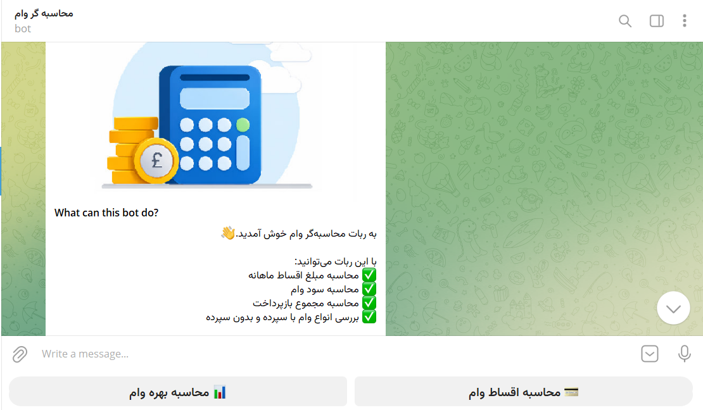
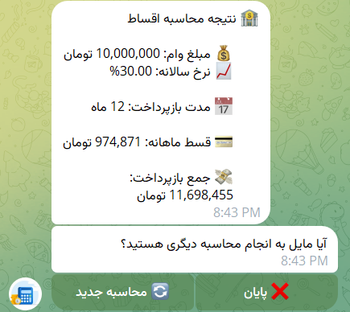
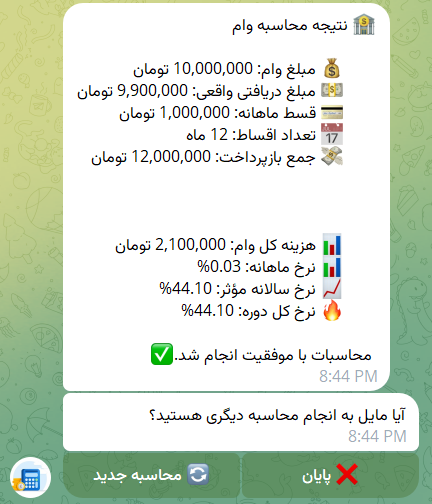
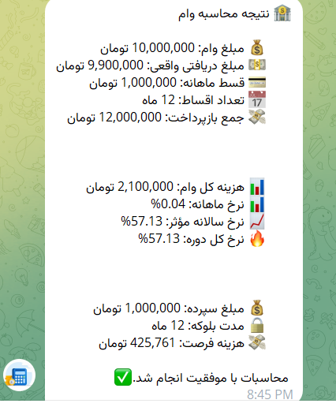

# 🏦 Loan Calculator Telegram Bot


A Telegram bot for calculating loan installments and effective loan interest rates.

## Features

* 💳 Calculate monthly loan installments
* 📊 Calculate effective loan interest rates
* 🏦 Support for loans with and without deposits
* 💰 Calculate deposit opportunity cost
* 📈 Calculate effective annual interest rate

## Installation

Install the required packages:

```bash
pip install -r requirements.txt
```

## Configuration

Create a `.env` file and add your bot token:

```env
BOT_TOKEN=YOUR_BOT_TOKEN
```

## Run

```bash
python bot.py
```

## Technologies Used

* Python
* pyTelegramBotAPI
* SciPy
* python-dotenv

## Author

Mehdi Esmaeilzadeh


### Bot Home Screen
The starting point of the bot, providing access to all available calculation tools.




💳 Loan Installment Calculator
Calculate monthly loan installments based on the loan amount, annual interest rate, and repayment period.




🏦 Loan Without Deposit
Calculate the effective interest rate of a standard loan using the actual received amount, loan fees, and repayment schedule




🔒 Loan With Deposit
Calculate the effective interest rate of deposit-backed loans by considering both loan costs and the opportunity cost of the blocked deposit.

